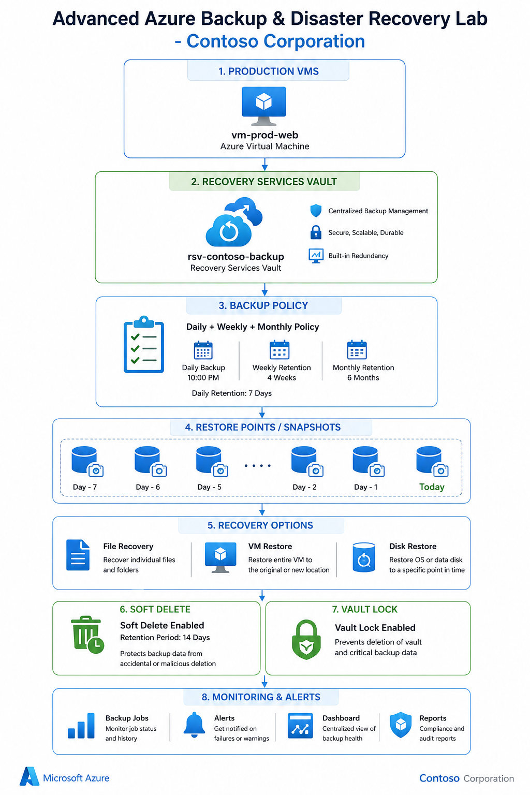

# 🚀 Advanced Azure Backup & Disaster Recovery Lab

## 🎯 Scenario
**Contoso Corporation** runs critical production workloads on Azure Virtual Machines.  
The company requires a secure and automated backup solution to protect against:

- Data loss
- Ransomware attacks
- Accidental deletion
- Compliance and retention requirements

This lab demonstrates how to configure Azure Backup and Disaster Recovery using a **Recovery Services Vault**.

---

# 🏗️ Architecture



---

# 📋 Lab Objectives

By completing this lab, you will learn how to:

- Create Azure Virtual Machines
- Configure Azure Backup
- Create custom backup policies
- Run on-demand backups
- Perform file recovery
- Enable Soft Delete protection
- Monitor backup and restore jobs

---

# 🔹 STEP 1 — Create Resource Group

1. Open the Azure Portal.
2. Search for **Resource groups**.
3. Click **+ Create**.

### Configuration

| Setting | Value |
|---|---|
| Resource Group Name | `rg-backup-lab` |
| Region | `UAE North` |

4. Click **Review + create**.
5. Click **Create**.

---

# 🔹 STEP 2 — Create Production Virtual Machine

1. Search for **Virtual machines**.
2. Click **+ Create** → **Azure virtual machine**.

## Basics Tab

| Setting | Value |
|---|---|
| Resource Group | `rg-backup-lab` |
| VM Name | `vm-prod-web` |
| Region | `UAE North` |
| Image | `Windows Server 2022 Datacenter` |
| Size | `Standard B2s` *(or D2s_v3)* |
| Authentication | Username & Password |

> Use strong administrator credentials.

## Networking Tab

- Allow inbound port:
  - `3389 (RDP)`

3. Click **Review + create**.
4. Click **Create**.

---

# 🔹 STEP 3 — Prepare Sample Data on VM

1. Connect to the VM using **RDP**.
2. Open **PowerShell as Administrator**.
3. Run the following commands:

```powershell
New-Item -Path "C:\Data" -ItemType Directory
New-Item -Path "C:\Projects" -ItemType Directory
New-Item -Path "C:\ImportantFiles" -ItemType Directory

Set-Content -Path "C:\ImportantFiles\backup-demo.txt" `
-Value "This is critical data - Backup Test 2026"

Set-Content -Path "C:\ImportantFiles\finance-report.docx" `
-Value "Financial Report - Do Not Delete"
```

✅ This simulates important business data stored on the production server.

---

# 🔹 STEP 4 — Create Recovery Services Vault

1. Search for **Recovery Services vaults**.
2. Click **+ Create**.

## Configuration

| Setting | Value |
|---|---|
| Vault Name | `rsv-contoso-backup` |
| Region | `UAE North` |
| Resource Group | `rg-backup-lab` |

3. Click **Review + create**.
4. Click **Create**.

---

# 🔹 STEP 5 — Create Backup Policy

1. Open the **Recovery Services Vault**.
2. In the left menu, select:
   - **Backup Policies**
3. Click **+ Add**.

## Policy Configuration

| Setting | Value |
|---|---|
| Policy Type | Azure Virtual Machine |
| Policy Name | `Daily-Weekly-Policy` |

### Backup Schedule

| Configuration | Value |
|---|---|
| Frequency | Daily |
| Time | 10:00 PM |

### Retention Rules

| Retention Type | Duration |
|---|---|
| Daily Retention | 7 Days |
| Weekly Retention | 4 Weeks |
| Monthly Retention | 6 Months |

4. Click **Create**.

---

# 🔹 STEP 6 — Enable Backup on VM

1. Inside the Recovery Services Vault:
   - Click **+ Backup**

## Backup Configuration

| Setting | Value |
|---|---|
| Workload Running | Azure |
| Backup Target | Virtual Machine |

2. Click **Add**.
3. Select:
   - `vm-prod-web`
4. Choose backup policy:
   - `Daily-Weekly-Policy`
5. Click **Enable backup**.

> Azure automatically installs the backup extension on the VM.

---

# 🔹 STEP 7 — Run On-Demand Backup

1. Go to:
   - **Backup Items**
   - **Azure Virtual Machine**
2. Select:
   - `vm-prod-web`
3. Click **Backup now**.
4. Choose retention settings.
5. Click **OK**.

✅ Azure starts creating a restore point immediately.

---

# 🔹 STEP 8 — Simulate Data Loss

1. RDP into:
   - `vm-prod-web`
2. Open **PowerShell as Administrator**.
3. Run the following command:

```powershell
Remove-Item -Path "C:\ImportantFiles" -Recurse -Force
```

⚠️ This simulates:
- Accidental deletion
- Malware or ransomware attack
- Critical file loss

---

# 🔹 STEP 9 — File Recovery (Most Important Test)

1. Return to the **Recovery Services Vault**.
2. Navigate to:
   - **Backup Items**
   - **Azure Virtual Machine**
   - `vm-prod-web`

3. Select a successful **Restore Point**.
4. Click **File Recovery**.

## Recovery Process

- Download the recovery script
- Run the script on the VM
- Mount the recovery point
- Browse mounted files
- Restore deleted files back to original location

✅ Verify that the deleted files are restored successfully.

---

# 🔹 STEP 10 — Enable Soft Delete

1. Open the **Recovery Services Vault**.
2. Go to:
   - **Properties**
3. Under **Soft Delete**:
   - Click **Enable**

## Configuration

| Setting | Value |
|---|---|
| Soft Delete | Enabled |
| Retention Period | 14 Days |

4. Click **Save**.

> Soft Delete protects backup data from accidental or malicious deletion.

---

# 🔹 STEP 11 — Monitor Backup Jobs

1. In the Recovery Services Vault:
   - Open **Backup Jobs**

2. Review:
   - Backup job status
   - Restore operations
   - Failed jobs
   - Warnings and alerts

3. Open:
   - **Backup Alerts**
   - **Monitoring Dashboard**

✅ Ensure all operations completed successfully.

---

# 🎉 Lab Completed Successfully!

## ✅ Skills Practiced

- Azure Backup Configuration
- Recovery Services Vault Management
- VM Protection
- Backup Policies
- On-Demand Restore Points
- File-Level Recovery
- Soft Delete Protection
- Backup Monitoring & Alerts

---

# 🧠 Real-World Use Cases

This lab simulates enterprise backup operations commonly used in:

- Financial organizations
- Healthcare systems
- Government environments
- Enterprise production workloads
- Disaster recovery planning

---

# 📚 Azure Services Used

- Azure Virtual Machines
- Recovery Services Vault
- Azure Backup
- Azure Monitoring
- File Recovery
- Soft Delete Protection

---

# 🔐 Security Best Practices

- Use strong administrator passwords
- Enable MFA for Azure accounts
- Restrict RDP access using NSGs
- Regularly test restore procedures
- Monitor backup alerts continuously


```
